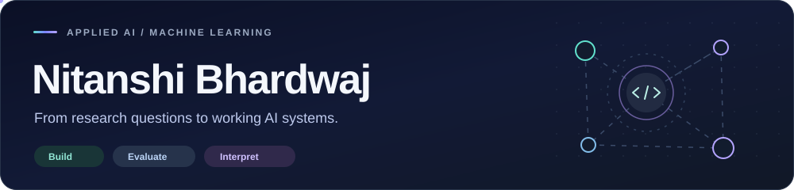

<p align="center">
  <a href="https://nitanshi-bhardwaj.github.io/">
    
  </a>
</p>

<p align="center">
  <strong>M.S. Data Science, Columbia University | Graduating December 2026</strong>
</p>

<p align="center">
  <a href="mailto:nb3308@columbia.edu">
    
  </a>
  <a href="https://www.linkedin.com/in/nitanshi-bhardwaj/">
    
  </a>
  <a href="https://nitanshi-bhardwaj.github.io/">
    
  </a>
</p>

## About

I build AI applications that make complex workflows easier to use, evaluate, and trust. My experience spans **clinical workflow automation, retrieval augmented generation, LLM evaluation, explainable AI, and real-time data tools**.

I am especially interested in what makes AI useful beyond a demo: **grounding, evaluation, interpretability, reliable workflows, and thoughtful interfaces**. I enjoy taking ambiguous problems from an initial idea to a working system that connects models, data, and software.

## Selected Projects

<table>
<tr>
<td width="50%" valign="top">
<h3><a href="https://github.com/Nitanshi-Bhardwaj/Github-Issue-Triage-Agent">GitHub Issue Triage Agent</a></h3>
<p>Retrieval augmented issue triage that suggests labels, severity, components, and potential duplicates. Combines similarity search with structured JSON outputs, a Streamlit interface, and a CLI workflow.</p>
<p><code>Python</code> <code>FAISS</code> <code>sentence-transformers</code> <code>Pydantic</code></p>
</td>
<td width="50%" valign="top">
<h3><a href="https://github.com/Nitanshi-Bhardwaj/LLM-SQL-Agent-n8n">Conversational SQL Agent</a></h3>
<p>A local text-to-SQL assistant for retail analytics. Connects natural language questions to MySQL through an n8n agent workflow, with Ollama inference, Docker deployment, and query guardrails.</p>
<p><code>n8n</code> <code>MySQL</code> <code>Ollama</code> <code>Docker</code></p>
</td>
</tr>
<tr>
<td width="50%" valign="top">
<h3><a href="https://github.com/Nitanshi-Bhardwaj/CSV-OSC-DataPlayer">Data Player</a></h3>
<p>Turns CSV and Excel data into tempo controlled Open Sound Control streams for data sonification. Built through Columbia's DSI Scholars program with playback controls and a defined message protocol.</p>
<p><code>Python</code> <code>Streamlit</code> <code>OSC</code> <code>Data streaming</code></p>
</td>
<td width="50%" valign="top">
<h3><a href="https://github.com/Nitanshi-Bhardwaj/LCA-Work-Visa-Trends">Work Visa Trends</a></h3>
<p>Explores six years of United States Labor Condition Application data, connecting employer, occupation, wage, and geographic patterns through data cleaning and reproducible reporting.</p>
<p><code>R</code> <code>Quarto</code> <code>Data analysis</code> <code>Visualization</code></p>
</td>
</tr>
</table>

**More to explore:** [Job Tracker](https://github.com/Nitanshi-Bhardwaj/Job-Tracker), a configurable job monitoring system using GitHub Actions and Telegram, and [Aspect Based Sentiment Analysis](https://github.com/Nitanshi-Bhardwaj/AspectBasedSentimentAnalysis), an NLP project analyzing sentiment toward specific aspects in restaurant reviews.

## Research and Teaching

- [**The Disagreement Dilemma in Explainable AI: Can Bias Reduction Bridge the Gap?**](https://doi.org/10.1007/s13198-025-02712-9)  
  Co-authored research comparing LIME, SHAP, and ALE, with analysis of bias, fairness, and disagreement between explanation methods. Published in Springer.

- [**Gesture Control for Enhanced Accessibility**](https://doi.org/10.1109/ICCDS64403.2025.11209599)  
  Co-authored research on gesture and voice interfaces for accessible device control using computer vision and real-time hardware interaction. Published in IEEE ICCDS 2025.

As a Teaching Assistant for **Ethical and Responsible AI** at Columbia University, I supported graduate students working with machine learning fairness, interpretation, and responsible AI concepts.

## Toolkit

| Area | Tools and methods |
| --- | --- |
| **Programming and data** | Python, SQL, R, Pandas, NumPy |
| **Machine learning** | PyTorch, TensorFlow, scikit-learn, XGBoost |
| **Generative AI** | RAG, embeddings, FAISS, Hugging Face, Ollama, prompt engineering, LLM evaluation |
| **Applications and cloud** | AWS Bedrock, EC2, SageMaker, Docker, Git, Streamlit, n8n |
| **Responsible AI** | Explainability, SHAP, LIME, ALE, fairness analysis, hallucination evaluation |

## Current Focus

```python
current_focus = {
    "degree": "M.S. Data Science, Columbia University",
    "interests": ["Generative AI", "RAG", "LLM Evaluation", "AI Automation"],
    "building": ["AI tools", "agent workflows", "clinical workflow automation"],
    "goal": "Build reliable AI systems that solve real problems"
}
```

<p align="center">
  <strong>Open to full-time AI/ML engineering, applied AI, and data science opportunities after graduation.</strong>
</p>
